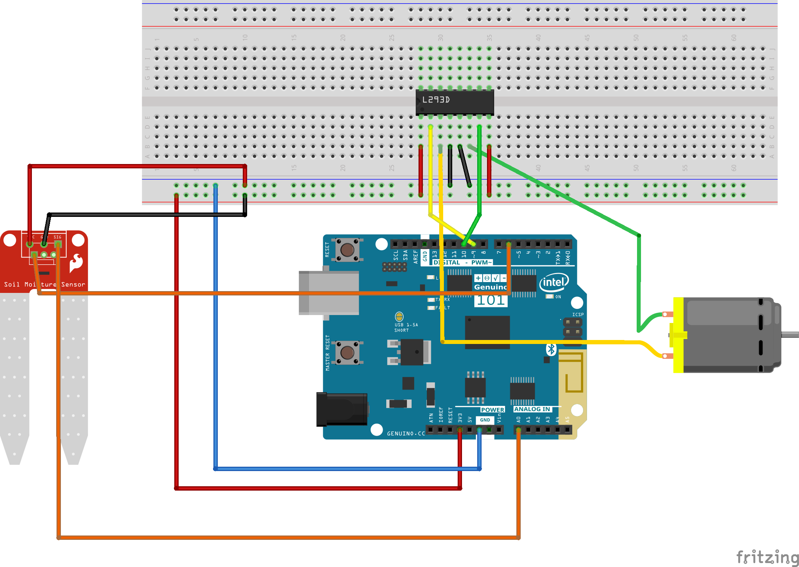

## Indoor Gardening Project
### With Genuino 101 and Companion Android App

Contributors: Pelin Pulcu, Irem Ucan

#### What is this project about?

When I heard about Intel Hacks, the submission data was hust one and half week away and I immediately wanted to create something with Genuino101 which we had in our laboratory. So I made the project, which was always in my mind: INDOOR GARDENING. I am still creating a sensor communication model for agricultural applications but it is still important for individuls to access some organic food. 

It is just a prototyped concept and it uses Arduino 101 to tell: GROW YOUR OWN FOOD NOW!

#### What are the specifications of the project?

_*Android*_

It is based from the BLE example of Android Demos. I added the interaction part with the Genuino101.

It can switch on/off lights with light characteristics.

Water the plant gradually. (It has 3 water levels.)

It can switch to a automatic mode to grow automatically your plant.

_*Arduino*_

It uses BLE to connect with Android.

It reads the soil humidity data with YL-69 soil humidity sensor.

It turn on/off lights with Android app command.

It pumps up motor with Android app command.

#### The project sketch:

You can also see Fritzing Source in Project-Sketch:

Inline-style: 
